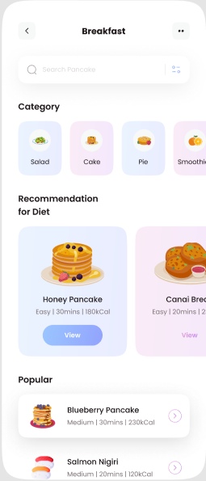
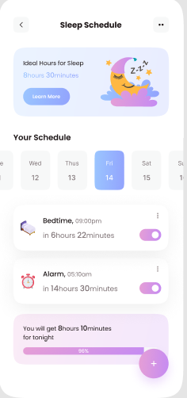

# Hình giao diện

## Onboarding

## Sign up, Login and Reset Password 

## Dashboard

## Workout Tracker

## Meal Planner

## Sleep Tracker

## Progress Tracker

# Mô tả Usecase

## Tổng quan usecase

### UC1. Đăng ký

| **Thuộc Tính**       | **Chi Tiết**                                                                                                      |
|----------------------|-------------------------------------------------------------------------------------------------------------------|
| **Use Case ID**       | UC_01                                                                                                             |
| **Name**              | Đăng ký                                                                                                           |
| **Goal**              | Cho phép người dùng đăng ký tài khoản để thực hiện đầy đủ chức năng trong ứng dụng.                               |
| **Actor(s)**          | Visitor                                                                                                           |
| **Pre-Condition(s)**  | N/A                                                                                                               |
| **Post-Condition(s)** | Nếu đăng ký thành công, dữ liệu tài khoản được thêm vào cơ sở dữ liệu.                                             |
| **Main Flow**         |  1. Tại trang chủ, Actors chọn biểu tượng tài khoản.   2. Ứng dụng chuyển sang “Thông tin cá nhân”.   3. Actors nhấn vào nút “Đăng nhập”.   4. Ứng dụng chuyển hướng đến trang đăng nhập, tại đây Actors chọn vào “Đăng ký”.   5. Ứng dụng chuyển sang trang đăng ký, bao gồm nút "Đăng nhập" và các trường thông tin trống bao gồm: Tên, Họ, Email, Mật Khẩu và Checkbox Chính sách bảo mật và Điều khoản sử dụng.   6. Actors nhập các trường thông tin và nhấn tích vào ô Checkbox.   7. Actors nhấn vào nút “Đăng ký”.   8. Hệ thống kiểm tra thông tin Actors nhập.   9. Ứng dụng chuyển đến trang điền thông tin cá nhân của Actors với các trường thông tin trống bao gồm: Giới tính, Sinh nhật, Cân nặng, Chiều cao.   10. Actors nhập các trường thông tin.   11. Actors nhấn nút “Xác nhận”.   12. Hệ thống kiểm tra thông tin.   13. Ứng dụng chuyển đến trang đăng ký thành công.   14. Actors nhấn vào nút “Trở về trang chủ”.   15. Ứng dụng chuyển hướng Actors đến trang chủ. |                                                              
| **Alternative Flow**  | 5.1. Actors nhấn vào “Đăng nhập” → UC_02 (A) (Đăng nhập).                                                       |
| **Exception Flow**    |  8.1. Một trong các trường thông tin bị bỏ trống thì hiển thị thông báo yêu cầu Actors nhập đầy đủ thông tin → Quay lại bước 5.   8.2. Một trong các trường thông tin không đúng định dạng thì hiển thị thông báo yêu cầu nhập lại → Quay lại bước 5.   8.3. Email đã tồn tại trong hệ thống thì hiển thị thông báo yêu cầu thay đổi email → Quay lại bước 4.   12.1. Một trong các trường thông tin bị bỏ trống thì hiển thị thông báo yêu cầu Actors nhập đầy đủ thông tin → Quay lại bước 9.   12.2. Một trong các trường thông tin không yêu cầu thì hiển thị thông báo yêu cầu nhập lại → Quay lại bước 9. |

### UC2. Đăng nhập

| **Thuộc Tính**       | **Chi Tiết**                                                                                                      |
|----------------------|-------------------------------------------------------------------------------------------------------------------|
| **Use Case ID**      | UC_02 (A)                                                                                                        |
| **Name**             | Đăng nhập                                                                                                         |
| **Goal**             | Cho phép Actors đăng nhập vào ứng dụng.                                                                          |
| **Actor(s)**         | Customer                                                                                                         |
| **Pre-Condition(s)** | Actors sở hữu tài khoản trong hệ thống.                                                                          |
| **Post-Condition(s)**| Actors đăng nhập thành công vào ứng dụng.                                                                        |
| **Main Flow**        | 1. Tại trang chủ, Actors nhấn vào biểu tượng tài khoản.   2. Ứng dụng chuyển sang trang “Thông tin cá nhân”.   3. Actors nhấn vào nút “Đăng nhập”.   4. Ứng dụng chuyển hướng đến trang đăng nhập bao gồm nút "Đăng nhập" và các trường thông tin trống bao gồm: Email, Mật Khẩu.   5. Actors nhập các trường thông tin.   6. Actors nhấn nút "Đăng nhập".   7. Hệ thống kiểm tra thông tin Actors nhập.   8. Ứng dụng chuyển hướng Actors đến trang chủ. |
| **Alternative Flow** | 4.1. Actors nhấn vào “Quên mật khẩu?” → UC_03 (Quên mật khẩu).   4.2. Actors nhấn vào “Đăng ký” → UC_01 (Đăng ký). |
| **Exception Flow**   | 7.1. Một trong các trường thông tin bắt buộc bị bỏ trống thì hiển thị thông báo yêu cầu Actors nhập đầy đủ thông tin bắt buộc → Quay lại bước 4.   7.2. Một trong các trường thông tin không đúng định dạng thì hiển thị thông báo yêu cầu nhập lại → Quay lại bước 4.   7.3. Email hoặc mật khẩu không khớp với dữ liệu trong hệ thống thì hiển thị thông báo yêu cầu nhập lại email hoặc mật khẩu → Quay lại bước 4.   7.4. Tài khoản Actors đã bị khóa thì hiển thị thông báo tài khoản Actors đã bị khóa → Quay lại bước 4. |

| **Thuộc Tính**       | **Chi Tiết**                                                                                                      |
|----------------------|-------------------------------------------------------------------------------------------------------------------|
| **Use Case ID**      | UC_02 (B)                                                                                                        |
| **Name**             | Đăng nhập                                                                                                         |
| **Goal**             | Cho phép Actors đăng nhập vào website quản lý ứng dụng.                                                          |
| **Actor(s)**         | Admin                                                                                                            |
| **Pre-Condition(s)** | Actors sở hữu tài khoản trong hệ thống.                                                                          |
| **Post-Condition(s)**| Actors đăng nhập thành công vào website.                                                                        |
| **Main Flow**        | 1. Truy cập vào địa chỉ website, hệ thống hiện ra form đăng nhập gồm các trường thông tin trống: Email, Mật khẩu.   2. Actors nhập thông tin vào các trường thông tin.   3. Actors nhấn nút “Đăng nhập”.   4. Hệ thống kiểm tra thông tin Actors nhập.   5. Hệ thống chuyển đến trang website của Admin quản lý ứng dụng. |
| **Alternative Flow** | 1.1. Actors nhấn vào “Quên mật khẩu?” → UC_03 (Quên mật khẩu).                                                 |
| **Exception Flow**   | 4.1. Một trong các trường thông tin bắt buộc bị bỏ trống thì hiển thị thông báo yêu cầu Actors nhập đầy đủ thông tin bắt buộc → Quay lại bước 1.   4.2. Một trong các trường thông tin không đúng định dạng thì hiển thị thông báo yêu cầu nhập lại → Quay lại bước 1.   4.3. Email hoặc mật khẩu không khớp với dữ liệu trong hệ thống thì hiển thị thông báo yêu cầu nhập lại email hoặc mật khẩu → Quay lại bước 1. |

### UC3. Quên mật khẩu

| **Thuộc Tính**       | **Chi Tiết**                                                                                                      |
|----------------------|-------------------------------------------------------------------------------------------------------------------|
| **Use Case ID**      | UC_03                                                                                                            |
| **Name**             | Quên mật khẩu                                                                                                   |
| **Goal**             | Cho phép Actors tạo mật khẩu mới khi quên mật khẩu.                                                            |
| **Actor(s)**         | Customer, Admin                                                                                                 |
| **Pre-Condition(s)** | Actors sở hữu tài khoản trong hệ thống.                                                                          |
| **Post-Condition(s)**| Actors tạo thành công mật khẩu mới.                                                                              |
| **Main Flow**        | 1. Tại trang đăng nhập hoặc trang chỉnh sửa thông tin cá nhân, Actors nhấn nút “Quên mật khẩu”.   2. Hệ thống chuyển hướng đến trang quên mật khẩu bao gồm nút "Gửi mã" và các trường thông tin trống là email.   3. Actors nhập vào email.   4. Actors nhấn nút “Đặt lại mật khẩu”.   5. Hệ thống kiểm tra thông tin Actors vừa nhập.   6. Hệ thống xác thực Email và gửi liên kết thay đổi mật khẩu đến Email đó.   7. Actors mở Email và nhấn vào liên kết.   8. Liên kết đưa Actors đến biểu mẫu.   9. Nhập mật khẩu mới và xác nhận.   10. Nhấn nút “Đặt lại mật khẩu”.   11. Hệ thống kiểm tra mật khẩu mới.   12. Hệ thống thông báo đổi mật khẩu mới thành công. |
| **Alternative Flow** | N/A                                                                                                              |
| **Exception Flow**   | 9.1. Hệ thống kiểm tra định dạng email không hợp lệ, hệ thống thông báo cho Actors → Quay về bước 2.   9.2. Hệ thống kiểm tra không tồn tại email có trong hệ thống, hệ thống thông báo cho Actors → Quay về bước 2.   15.1. Hệ thống kiểm tra mật khẩu mới và mật khẩu xác nhận không khớp, hệ thống thông báo cho Actors → Quay lại bước 12. |

### UC4. Đăng xuất

| **Thuộc Tính**       | **Chi Tiết**                                                                                                      |
|----------------------|-------------------------------------------------------------------------------------------------------------------|
| **Use Case ID**      | UC_04                                                                                                            |
| **Name**             | Đăng xuất                                                                                                        |
| **Goal**             | Cho phép Actors đăng xuất khỏi ứng dụng.                                                                        |
| **Actor(s)**         | Customer, Admin                                                                                                 |
| **Pre-Condition(s)** | Actors đã được đăng nhập thành công.                                                                            |
| **Post-Condition(s)**| Actors đăng xuất thành công khỏi ứng dụng.                                                                      |
| **Main Flow**        | 1. Tại trang chủ, Actors nhấn vào biểu tượng tài khoản.   2. Ứng dụng chuyển sang trang “Thông tin cá nhân”.   3. Actors nhấn vào nút “Đăng xuất”.   4. Hệ thống tiến hành đăng xuất tài khoản khỏi hệ thống.   5. Hệ thống thông báo đăng xuất thành công. |
| **Alternative Flow** | N/A                                                                                                              |
| **Exception Flow**   | N/A                                                                                                              |

### UC5. Tìm kiếm/Xem chức năng chính trong ứng dụng

| **Thuộc Tính**       | **Chi Tiết**                                                                                                      |
|----------------------|-------------------------------------------------------------------------------------------------------------------|
| **Use Case ID**      | UC_05                                                                                                            |
| **Name**             | Tìm kiếm/Xem chức năng chính trong ứng dụng                                                                      |
| **Goal**             | Cho phép Actors xem hoặc tìm kiếm các chức năng có sẵn trong ứng dụng.                                          |
| **Actor(s)**         | Customer, Visitor                                                                                               |
| **Pre-Condition(s)** | N/A                                                                                                              |
| **Post-Condition(s)**| Actors xem hoặc tìm kiếm được chức năng mà mình muốn.                                                          |
| **Main Flow**        | 1. Tại trang chủ, Actors chọn vào biểu tượng “Tìm kiếm”.   2. Trang chủ sổ ra khung tìm kiếm.   3. Actors nhập thông tin mình muốn tìm kiếm.   4. Ứng dụng hiển thị chức năng trùng khớp với nội dung tìm kiếm của Actors.   5. Actors chọn và xem nội dung chức năng mà mình tìm kiếm. |
| **Alternative Flow** | 5.1. Actors chọn chức năng muốn thực hiện.   5.1.1. Nếu Actors là Visitor → UC_02 (A) (Đăng nhập).          |
| **Exception Flow**   | 4. Ứng dụng hiển thị thông báo “Không tìm thấy kết quả” → Quay lại bước 2.                                      |

### UC6. Quản lý thông tin cá nhân

| **Thuộc Tính**       | **Chi Tiết**                                                                                                      |
|----------------------|-------------------------------------------------------------------------------------------------------------------|
| **Use Case ID**      | UC_06                                                                                                            |
| **Name**             | Quản lý thông tin cá nhân                                                                                       |
| **Goal**             | Cho phép Actors xem, điều chỉnh những thông tin theo ý muốn.                                                   |
| **Actor(s)**         | Customer                                                                                                         |
| **Pre-Condition(s)** | Tài khoản Actors đã được đăng nhập thành công.                                                                 |
| **Post-Condition(s)**| Actors xem, điều chỉnh thông tin mà mình muốn.                                                                |
| **Main Flow**        | 1. Tại trang chủ, Actors nhấn vào biểu tượng tài khoản.   2. Ứng dụng chuyển sang trang “Thông tin cá nhân”.   3. Tại màn hình “Thông tin cá nhân”, Actors nhấn chọn vào chức năng mà mình muốn. |
| **Alternative Flow**  | - Actors chọn vào nút Edit để thay đổi thông tin cá nhân → UC_07 (Thay đổi thông tin cá nhân).   - Actors chọn vào mục “Ngôn ngữ” để thay đổi ngôn ngữ → UC_08 (Thay đổi ngôn ngữ).   - Actors chọn vào mục “Liên lạc” để liên lạc với Admin nhằm đóng góp ý kiến, phản hồi → UC_09 (Liên lạc với Admin).   - Actors chọn vào mục “Đăng xuất” để đăng xuất tài khoản → UC_04 (Đăng xuất).   - Actors chọn vào nút gạt bên cạnh mục “Thông báo” để tắt/bật chức năng nhận thông báo.   - Actors chọn vào nút gạt bên cạnh mục “Màn hình tối” để tắt/bật chức năng. |
| **Exception Flow**    | N/A                                                                                                             |

### UC7. Thay đổi thông tin cá nhân

| **Thuộc Tính**       | **Chi Tiết**                                                                                                      |
|----------------------|-------------------------------------------------------------------------------------------------------------------|
| **Use Case ID**      | UC_07                                                                                                            |
| **Name**             | Thay đổi thông tin cá nhân                                                                                     |
| **Goal**             | Cho phép Actors thay đổi thông tin tài khoản.                                                                  |
| **Actor(s)**         | Customer                                                                                                         |
| **Pre-Condition(s)** | Tài khoản Actors đã được đăng nhập thành công.                                                                  |
| **Post-Condition(s)**| Actors thay đổi thông tin tài khoản thành công.                                                                |
| **Main Flow**        | 1. Tại màn hình trang “Thông tin cá nhân”, Actors nhấn nút “Edit”.   2. Ứng dụng chuyển hướng sang trang “Chỉnh sửa thông tin”.   3. Tại màn hình trang “Chỉnh sửa thông tin” bao gồm các trường thông tin Actors có thể điều chỉnh trực tiếp tại trang như: Tên, Họ, Giới Tính, Ngày sinh, Cân nặng (kg), Chiều cao (cm).   4. Actors chỉnh sửa các trường thông tin.   5. Actors nhấn nút “Save” để lưu thông tin.   6. Ứng dụng hiển thị thông báo thay đổi thông tin thành công.   7. Ứng dụng điều hướng Actors về trang chủ. |
| **Alternative Flow** | 3.1. Actors nhấn chọn nút “Change Password” để tiến hành thay đổi mật khẩu → UC_08 (Thay đổi mật khẩu).       |
| **Exception Flow**   | 6.1. Một trong các trường thông tin bắt buộc bị bỏ trống thì hiển thị thông báo yêu cầu Actors nhập đầy đủ thông tin bắt buộc. Quay lại bước 3.   6.2. Một trong các trường thông tin không đúng định dạng thì hiển thị thông báo yêu cầu nhập lại. Quay lại bước 3. |

### UC8. Thay đổi ngôn ngữ

| **Thuộc Tính**       | **Chi Tiết**                                                                                                      |
|----------------------|-------------------------------------------------------------------------------------------------------------------|
| **Use Case ID**      | UC_08                                                                                                            |
| **Name**             | Thay đổi ngôn ngữ                                                                                                |
| **Goal**             | Cho phép Actors thay đổi ngôn ngữ.                                                                              |
| **Actor(s)**         | Customer                                                                                                         |
| **Pre-Condition(s)** | Tài khoản Actors đã được đăng nhập thành công. Actors đang ở trang “Thông tin cá nhân”.                     |
| **Post-Condition(s)**| Ngôn ngữ hiển thị của ứng dụng được thay đổi theo lựa chọn của Actors. Thông tin ngôn ngữ mới được lưu lại trong hồ sơ Actors. |
| **Main Flow**        | 1. Actors truy cập trang “Thông tin cá nhân”.   2. Actors chọn mục “Thay đổi ngôn ngữ”.   3. Hệ thống hiển thị danh sách các ngôn ngữ có sẵn.   4. Actors chọn ngôn ngữ mong muốn từ danh sách.   5. Hệ thống cập nhật ngôn ngữ hiển thị của ứng dụng theo lựa chọn của Actors.   6. Hệ thống lưu lại thông tin ngôn ngữ mới trong hồ sơ Actors.   7. Hệ thống thông báo cho Actors rằng ngôn ngữ đã được thay đổi thành công. |
| **Alternative Flow** | 4. Nếu Actors không chọn ngôn ngữ nào và thoát khỏi mục “Thay đổi ngôn ngữ”:   4.1. Hệ thống không thay đổi ngôn ngữ hiển thị.   4.2. Hệ thống giữ nguyên ngôn ngữ hiện tại. |
| **Exception Flow**   | 7. Nếu xảy ra lỗi trong quá trình cập nhật ngôn ngữ:   7.1. Hệ thống hiển thị thông báo lỗi cho Actors.   7.2. Hệ thống giữ nguyên ngôn ngữ hiện tại.   7.3. Actors có thể thử lại hoặc liên hệ hỗ trợ kỹ thuật → UC_10 (Liên lạc với Admin). |
